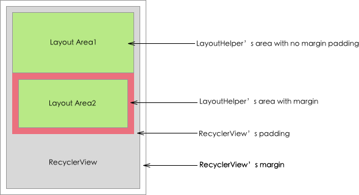
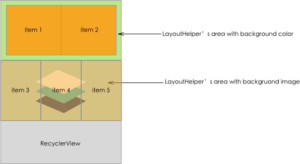
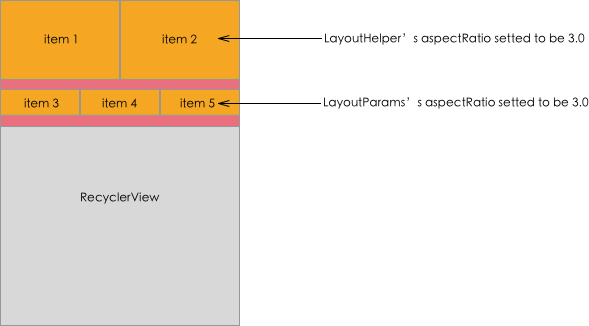
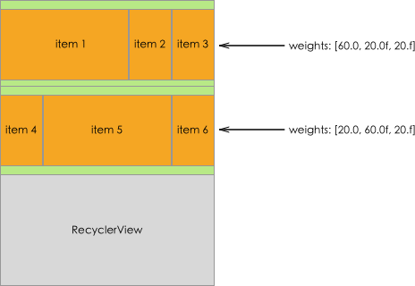
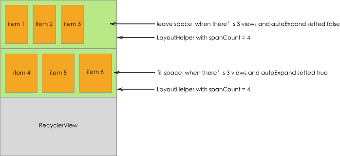
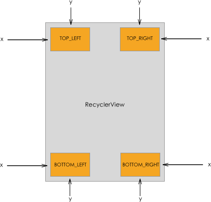
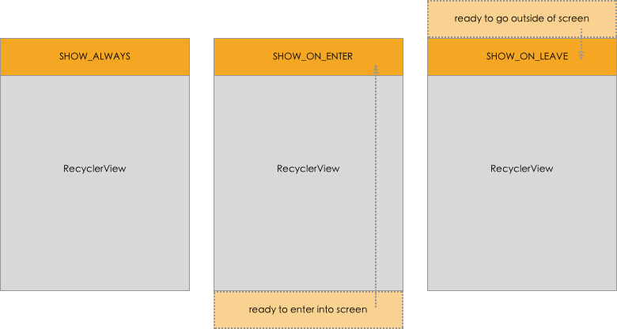
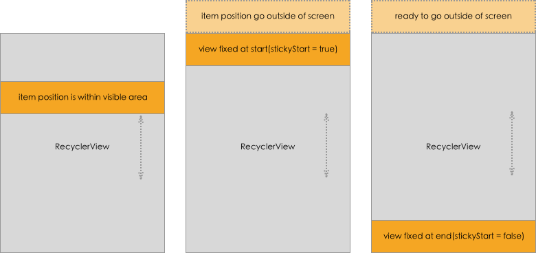

为了提供丰富的布局能力，我们为```LayoutHelper```设计了一系列布局属性，用来控制布局逻辑和样式。这里介绍这些属性的概念和用法。

[Englist Document](ATTRIBUTES.md)

# margin, padding

Margin, padding就是外边距、内边距，概念与Android系统的margin, padding一样，但也有不同的地方：

+ 它不是整个```RecyclerView```页面的margin和padding，它是每一块```LayoutHelper```所负责的区域的margin和padding。
+ 一个页面里可以有多个```LayoutHelper```，意味着不同```LayoutHelper```可以设置不同的margin和padding。
+ ```LayoutHelper```的margin和padding与页面```RecyclerView```的margin和padding可以共存。



### 接口

对于```LayoutHelper```，调用

```public void setPadding(int leftPadding, int topPadding, int rightPadding, int bottomPadding)```

```public void setMargin(int leftMargin, int topMargin, int rightMargin, int bottomMargin)```

# bgColor, bgImg

背景颜色或者背景图，这其实不是布局属性，但是由于在vlayout对视图进行了直接布局，不同区域的视图的父节点都是```RecyclerView```，如果想要针对某一块区域单独绘制背景，就很难做到了。vlayout框架对此做了特殊处理，对于非fix、非float类型的```LayoutHelper```，支持配置背景色或背景图。



### 接口

使用背景色

```public void setBgColor(int bgColor)```

使用背景图

首先为```LayoutManager```提供一个```ImageView```简单工厂

```
this.mLayoutManager.setLayoutViewFactory(new LayoutViewFactory() {
            @Override
            public opinion generateLayoutView(@NonNull Context context) {
                return new XXImageView(context);
            }
        });
```

再为```LayoutHelper```提设置图片加载的```Listener```

```
baseHelper.setLayoutViewBindListener(new BindListener(imgUrl));
baseHelper.setLayoutViewUnBindListener(new UnbindListener(imgUrl));


private static class BindListener implements BaseLayoutHelper.LayoutViewBindListener {
        private String imgUrl;

        public BindListener(String imgUrl) {
            this.imgUrl = imgUrl;
        }

        @Override
        public void onBind(View layoutView, BaseLayoutHelper baseLayoutHelper) {
            //loading image
        }
    }

    private static class UnbindListener implements BaseLayoutHelper.LayoutViewUnBindListener {
        private String imgUrl;

        public UnbindListener(String imgUrl) {
            this. imgUrl = imgUrl;
        }

        @Override
        public void onUnbind(View layoutView, BaseLayoutHelper baseLayoutHelper) {
        		//cancel loading image
        }
    }
```

# aspectRatio

为了保证布局过程中视图的高度一致，我们设计了aspectRatio属性，它是宽与高的比例，```LayoutHelper```里有aspectRatio属性，通过vlayout添加的视图的```LayoutParams```也有aspectRatio属性，后者的优先级比前者高，但含义不一样。

+ ```LayoutHelper```定义的aspectRatio，指的是一行视图整体的宽度与高度之比，当然整体的宽度是减去了```RecyclerView和```对应的```LayoutHelper```的margin, padding。
+ 视图的```LayoutParams```定义的aspectRatio，指的是在```LayoutHelper```计算出视图宽度之后，用来确定视图高度时使用的，它会覆盖通过```LayoutHelper```的aspectRatio计算出来的视图高度，因此具备更高优先级。



### 接口

对于```LayoutHelper```，调用

```public void setAspectRatio(float aspectRatio)```

对于```LayoutParams```，调用

```((VirutalLayoutManager.LayoutParams) layoutParams).mAspectRatio```

# dividerHeight

```LinearLayoutHelper```的属性，```LinearLayoutHelper```是像```ListView```一样的线性布局，dividerHeight就是每个组件之间的间距。


### 接口

对于```LinearLayoutHelper```，调用

```public void setDividerHeight(int dividerHeight)```

# weights

```ColumnLayoutHelper```, ```GridLayoutHelper```的属性，它们都是提供网格状的布局能力，**建议使用```GridLayoutHelper```**，它的能力更加强大，参考下文介绍。默认情况下，每个网格中每一列的宽度是一样的，通过weights属性，可以指定让每一列的宽度成比例分配，就像```LinearLayout```的weight属性一样。
weights属性是一个float数组，每一项代表某一列占父容器宽度的百分比，总和建议是100，否则布局会超出容器宽度；如果布局中有4列，那么weights的长度也应该是4；长度大于4，多出的部分不参与宽度计算；如果小于4，不足的部分默认平分剩余的空间。



### 接口

对于```ColumnLayoutHelper```, ```GridLayoutHelper```，调用

```public void setWeights(float[] weights)```

# vGap, hGap

```GridLayoutHelper```与```StaggeredGridLayoutHelper```都有这两个属性，分别控制视图之间的垂直间距和水平间距。


### 接口

对于```GridLayoutHelper```, ```StaggeredGridLayoutHelper```，调用

```public void setHGap(int hGap)```

```public void setVGap(int vGap)```

# spanCount, spanSizeLookup

```GridLayoutHelper```的属性，参考于系统的```GridLayoutManager```，spanCount表示网格的列数，默认情况下每一个视图都占用一个网格区域，但通过提供自定义的spanSizeLookUp，可以指定某个位置的视图占用多个网格区域。


### 接口

使用spanCount调用

```public void setSpanCount(int spanCount)```

使用spanSizeLookup

```public void setSpanSizeLookup(SpanSizeLookup spanSizeLookup)```

# autoExpand

```GridLayoutHelper```的属性，当一行里视图的个数少于spanCount值的时候，如果autoExpand为true，视图的总宽度会填满可用区域；否则会在屏幕上留空白区域。



### 接口

调用

```public void setAutoExpand(boolean isAutoExpand)```

# lane

```StaggeredGridLayoutHelper```中有这个属性，与```GridLayoutHelper```里的spanCount类似，控制瀑布流的列数。

### 接口

调用

```public void setLane(int lane)```

# fixAreaAdjuster

fix类型的```LayoutHelper```，在可能需要设置一个相对父容器四个边的偏移量，比如整个页面里有一个固定的标题栏添加在vlayout容器上，vlayout内部的fix类型视图不希望与外部的标题有所重叠，那么就可以设置一个fixAreaAdjuster来做偏移。


### 接口

调用

```public void setAdjuster(FixAreaAdjuster adjuster)```

# alignType, x, y

```FixLayoutHelper```, ```ScrollFixLayoutHelper```, ```FloatLayoutHelper```的属性，表示吸边时的基准位置，有四个取值，分别是```TOP_LEFT```, ```TOP_RIGHT```, ```BOTTOM_LEFT```, ```BOTTOM_RIGHT```。```x```和```y```是相对这四个位置的偏移量，最终的偏移量还要受上述的fixAreaAdjuster影响。

+ ```TOP_LEFT```：基准位置是左上角，```x```是视图左边相对父容器的左边距偏移量，```y```是视图顶边相对父容器的上边距偏移量；
+ ```TOP_RIGHT```：基准位置是右上角，```x```是视图右边相对父容器的右边距偏移量，```y```是视图顶边相对父容器的上边距偏移量；
+ ```BOTTOM_LEFT```：基准位置是左下角，```x```是视图左边相对父容器的左边距偏移量，```y```是视图底边相对父容器的下边距偏移量；
+ ```BOTTOM_RIGHT```：基准位置是右下角，```x```是视图右边相对父容器的右边距偏移量，```y```是视图底边相对父容器的下边距偏移量；



### 接口

设置基准调用

```public void setAlignType(int alignType)```

设置偏移量调用

```public void setX(int x)```

```public void setY(int y)```

# showType

```ScrollFixLayoutHelper```的属性，取值有```SHOW_ALWAYS```, ```SHOW_ON_ENTER```, ```SHOW_ON_LEAVE```。

+ ```SHOW_ALWAYS```：与```FixLayoutHelper```的行为一致，固定在某个位置；
+ ```SHOW_ON_ENTER```：默认不显示视图，当页面滚动到这个视图的位置的时候，才显示；
+ ```HOW_ON_LEAVE```：默认不显示视图，当页面滚出这个视图的位置的时候显示；



调用

```public void setShowType(int showType)```

# stickyStart, offset

```StickyLayoutHelper```的属性，当视图的位置在屏幕范围内时，视图会随页面滚动而滚动；当视图的位置滑出屏幕时，```StickyLayoutHelper```会将视图固定在顶部（```stickyStart = true```）或者底部（```stickyStart = false```），固定的位置支持设置偏移量offset。



调用

```public void setStickyStart(boolean stickyStart)```

```public void setOffset(int offset)```