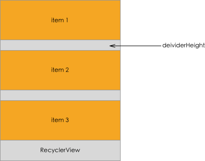
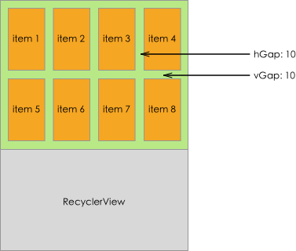
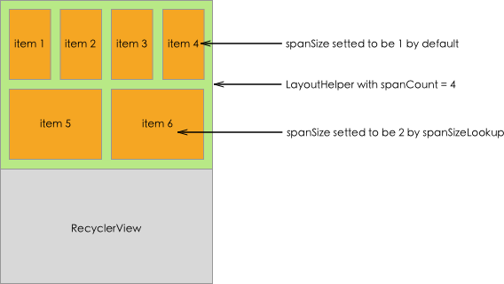
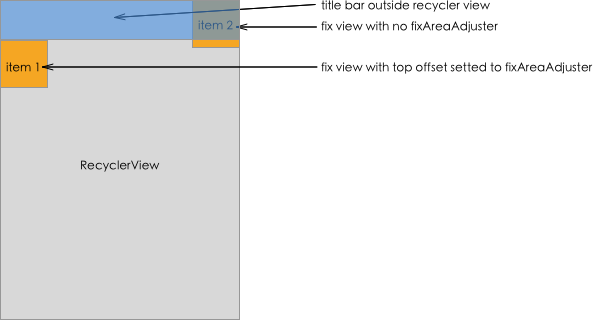

Vlayout provides rich layout features, which are presented in the form of a serial of layout attributes technically. Here we introduce these attributes.

[中文文档](ATTRIBUTES-ch.md)

# margin, padding

Margin, padding have the similar concepts as normal Android system's margin and padding. There are several difference you should know:

+ Here we say margin and padding, specificly mean ```LayoutHelper```'s margin and padding, not the ```RecyclerView```'s.
+ A ```RecyclerView``` could contains more than one layoutHelpers, which means each ```LayoutHelper``` is able to host its own margin and padding value.
+ ```LayoutHelper```'s margin and padding can coexist with ```RecylerView```'s margin and padding.
+ Margin and padding is mainly supported by non-fix LayoutHelper.


### API

For ```LayoutHelper```，call

```public void setPadding(int leftPadding, int topPadding, int rightPadding, int bottomPadding)```

```public void setMargin(int leftMargin, int topMargin, int rightMargin, int bottomMargin)```

# bgColor, bgImg

Actually, background color or background image has nothing to do with layout logic. But in our framework, all child views has the same parent which is ```RecyclerView```. If you want to fill background to a certain area with a color or image, it's a hard job. Vlayout has done some effort to make it possible for non-fix ```LayoutHelper```, so it's explained here.


### API

Fill background with color, call

```public void setBgColor(int bgColor)```

Fill background with image,

First, provide a simple factory to produce ```ImageView``` to ```LayoutManager```,

```
this.mLayoutManager.setLayoutViewFactory(new LayoutViewFactory() {
            @Override
            public View generateLayoutView(@NonNull Context context) {
                return new XXImageView(context);
            }
        });
```

Second, set image load listeners to ```LayoutHelper```,

```
baseHelper.setLayoutViewBindListener(new BindListener(imgUrl));
baseHelper.setLayoutViewUnBindListener(new UnbindListener(imgUrl));


private static class BindListener implements BaseLayoutHelper.LayoutViewBindListener {
        private String imgUrl;

        public BindListener(String imgUrl) {
            this.imgUrl = imgUrl;
        }

        @Override
        public void onBind(View layoutView, BaseLayoutHelper baseLayoutHelper) {
            //loading image
        }
    }

    private static class UnbindListener implements BaseLayoutHelper.LayoutViewUnBindListener {
        private String imgUrl;

        public UnbindListener(String imgUrl) {
            this. imgUrl = imgUrl;
        }

        @Override
        public void onUnbind(View layoutView, BaseLayoutHelper baseLayoutHelper) {
        		//cancel loading image
        }
    }
```

# aspectRatio

In order to uniform child view's height during layout, vlayout introduces aspectRatio. Generally the view's width is decided by ```LayoutHelper``` while its height is decided by the view itself, using aspectRatio allow ```LayoutHelper``` to decide view's height. Both ```LayoutHelper``` and ```LayoutParams``` of the view inside vlayout have this attribute. It generally means width/height ratio, but has slight difference in these two situations. The latter has a higher priority than the former.

+ The aspectRatio defined by ```LayoutHelper``` means the ratio of width of one entire row's view to height of this row's height. Here ```RecyclerView```'s margin padding and ```LayoutHelper```'s margin padding is not included in the width of entire row's view.
+ The aspectRatio defined in ```VirtualLayoutManager.LayoutParams``` means the ratio of width of this view to height of this view. The height calculated by this way will override ```LayoutHelper```'s calculation result, so it has higher priority.


### API

For ```LayoutHelper```, call

```public void setAspectRatio(float aspectRatio)```

For ```LayoutParams```, call

```((VirutalLayoutManager.LayoutParams) layoutParams).mAspectRatio```

# dividerHeight

```LinearLayoutHelper```'s attribute. ```LinearLayoutHelper``` performs like ```ListView```, so as you know, dividerHeight is the gap between items.



### API

For ```LinearLayoutHelper```, call

```public void setDividerHeight(int dividerHeight)```

# weights

```ColumnLayoutHelper``` and ```GridLayoutHelper```'s attribute, they both provide grid layout ability like ```GridLayoutManager```. **You are suggested to use ```GirdLayoutHelper```** since it is more powerful. By default, each column's width is equal and shares the available space. Setting weights allows each column's width occupies a certain percentage of available space. Just sounds like weight in ```LinearLayout```.

This arribute is a float array, each item in array means the percentage of a column width. The sum of item value in array is 100, otherwise child view may be layouted outside the box. If there are four columns in this layout, the suggested length of weights is four, too. If length of weights array is larged than 4, the extra weight provided is ignored. If length of weights array is less than 4, the remaining views with no weight assigned share the ramaining available space.


### API

For ```ColumnLayoutHelper```, ```GridLayoutHelper```, call

```public void setWeights(float[] weights)```

# vGap, hGap

```GridLayoutHelper``` and ```StaggeredGridLayoutHelper```'s attribute, vGap defines the vertical gap between child views, hGap defines the horizontal gap between child views.



### API

For ```GridLayoutHelper```, ```StaggeredGridLayoutHelper```, call

```public void setHGap(int hGap)```
```public void setVGap(int vGap)```

# spanCount, spanSizeLookup

```GridLayoutHelper```'s attribute, concept borrowed from system's ```GridLayoutManager```. SpanCount specifies the column count, or grid count each line in other word. By default each item view in ```GridLayoutHelper``` occupies one grid, but with custom spanSizeLookup it allows one item view could occupy more than one grid space.



### API

Setting spanCount call

```public void setSpanCount(int spanCount)```

Setting spanSizeLookup call

```public void setSpanSizeLookup(SpanSizeLookup spanSizeLookup)```

# autoExpand

```GridLayoutHelper```'s attribute. On the occasion of one line view's count is less than spanCount, if autoExpand setted to be true, these view will expand to fill all available space, otherwise they will leave some blank area.


### API

```public void setAutoExpand(boolean isAutoExpand)```

# lane

```StaggeredGridLayoutHelper```'s attribute, performs like spanCount in ```GridLayoutHelper```.

### API

```public void setLane(int lane)```

# fixAreaAdjuster

```LayoutHelper``` with fix behavior may need an offset to four edges of parent container. For example, an activity has a vlayout container with fullscreen size, there's an title bar on top of vlayout's container which is not part of vlayout. While a view inside vlayout wants to be fixed at top of vlayout, so it needs an offset to top edge to avoid overlapping with title bar outside.



### API

```public void setAdjuster(FixAreaAdjuster adjuster)```

# alignType, x, y

```FixLayoutHelper```, ```ScrollFixLayoutHelper```, ```FloatLayoutHelper```'s arributes, alignType defines the base position of fix area, there are four available values: ```TOP_LEFT```, ```TOP_RIGHT```, ```BOTTOM_LEFT```, ```BOTTOM_RIGHT```. ```x``` and ```y``` are the horizontal offset and vertical offset to this base position. The final offset is calculated with fixAreaAdjuster in addition as former mentioned.

+ ```TOP_LEFT```: base position is top left corner of parent container, ```x``` is the offset from child view's left edge to parent's left edge, ```y``` is the offset from child view's top edge to parent's top edge;
+ ```TOP_RIGHT```: base position is top right corner of parent container, ```x``` is the offset from child view's right edge to parent's right edge, ```y``` is the offset from child view's top edge to parent's top edge;
+ ```BOTTOM_LEFT```: base position is bottom left corner of parent container, ```x``` is the offset from child view's left edge to parent's left edge, ```y``` is the offset from child view's bottom edge to parent's bottom edge;
+ ```BOTTOM_RIGHT```: base position is bottom right corner of parent container, ```x``` is the offset from child view's right edge to parent's right edge, ```y``` is the offset from child view's bottom edge to parent's bottom edge;


### API

Setting alignType call

```public void setAlignType(int alignType)```

Setting offset call

```public void setX(int x)```

```public void setY(int y)```

# showType

```ScrollFixLayoutHelper```'s attribute, there are three available values: ```SHOW_ALWAYS```, ```SHOW_ON_ENTER```, ```SHOW_ON_LEAVE```.

+ ```SHOW_ALWAYS```: in this way, ```ScrollFixLayoutHelper``` performs the same as ```FixLayoutHelper```;
+ ```SHOW_ON_ENTER```: in this way, the child view in ```LayoutHelper``` does not show by default. It shows only when the page scroll to its position.
+ ```SHOW_ON_LEAVE```: in this way, the child view in ```LayoutHelper``` does not show by default, either. It shows only when the page scroll over its position.


### API

```public void setShowType(int showType)```

# stickyStart, offset

```StickyLayoutHelper```'s attribute, when child view's position is inside the screen visible area, the child view scrll with whole page; when child view position scrolls outside the screen, this ```LayoutHelper``` will fix the at top(```stickyStart = true```) or bottom(```stickyStart = false```). The fix position is also affected by offset value.


### API

```public void setStickyStart(boolean stickyStart)```

```public void setOffset(int offset)```